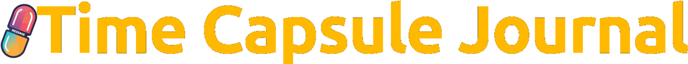

# Time Capsule Journal

A minimalist **time capsule journaling web app** built with Flask where users write entries to their future selves. Entries remain locked until a chosen future date, with authentication via **Google OAuth**.

<p align="center"><br/></p>

---

## Features

- Write journal entries for your future self
- Lock entries until a selected date (minimum 5 days)
- Preset unlock options: 30 days, 90 days, 6 months, 1 year, or custom
- Dashboard showing:
  - Locked capsules (with countdowns)
  - Unlocked capsules (with "New" badge until read)
- Stats: total capsules written, waiting to unlock, unlocked, next unlock date
- Responsive UI for mobile
- Dark mode toggle
- Clean, minimal, and calm design using **Tailwind CSS** and **Alpine.js**

---

## Tech Stack

- **Backend:** Python Flask  
- **Database:** SQLite  
- **Frontend:** Tailwind CSS and Alpine.js
- **Authentication:** Google OAuth

---

## Installation

```bash
# Clone the repository
git clone https://github.com/tejasashinde/time-capsule-journal-app
cd time-capsule-journal-app

# Create and activate virtual environment
python3 -m venv venv
source venv/bin/activate   # Linux/macOS
# venv\Scripts\activate    # Windows

# Install Python dependencies
pip3 install -r requirements.txt

# Install Node dependencies (for Tailwind)
npm install

# Run the app
python3 run.py
